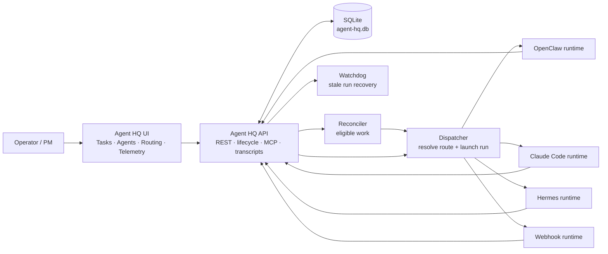

# Agent HQ

**Agent HQ is a source-available control plane for AI agents doing real work.**

Route tasks to agents, enforce evidence gates, track runs, and automatically move work forward based on agent outcomes and external events.

Agent HQ sits between your planning system and your AI agent runtimes. It gives every agent run structured context, deterministic workflow rules, verifiable handoffs, and operator visibility.


---

## Why Agent HQ exists

AI agents can now write code, run tests, call tools, update files, and operate inside real environments.

The hard part is no longer just “how do I run an agent?”

The hard part is:

- Which agent should receive this task?
- What context should it get?
- What outcome is it allowed to post?
- What evidence must it provide?
- What happens next?
- When should a human review the work?
- How do I audit what happened?

Agent HQ turns agent execution into a governed workflow.

Instead of ad hoc prompts and one-off agent runs, Agent HQ gives you a configurable task lifecycle:

```text
task → route → agent run → evidence → outcome → transition → next status / next agent
```

---

## What you can build with Agent HQ

Agent HQ is highly configurable, but it ships with opinionated Development, Ops, and Lead Generation starter workflows out of the box.

Example:

```text
ready
  → backend agent works in an isolated task worktree
  → agent posts "ready for review"
  → Agent HQ verifies required evidence, such as commit hash and review URL
  → task moves to review
  → QA agent runs
  → QA pass moves task forward
  → QA fail routes task back to development
  → deploy event moves task into deployed / verification states
```

The same workflow model can also be used for:

- autonomous software delivery
- QA and release pipelines
- research workflows
- operations workflows
- support escalation workflows
- compliance review workflows
- AI agency delivery pipelines
- human-in-the-loop agent processes

---

## Core features

| Capability | What it does |
|---|---|
| **Task orchestration** | Organize work into projects, sprints/workflows, tasks, task types, statuses, and priorities. |
| **No-code workflow configuration** | Configure task types, custom fields, statuses, outcomes, assignment rules, transitions, and gates through the UI. |
| **Deterministic task assignment** | Assign tasks to agents based on workflow, task type, and current status. |
| **Outcome-driven transitions** | Map agent-posted outcomes to the next task status. |
| **Evidence gates** | Require specific fields or artifacts before an outcome can move a task forward. |
| **External event routing** | Map runtime, deployment, or integration events to workflow actions. |
| **Multi-runtime agents** | Dispatch work to OpenClaw, Claude Code, Hermes, webhook agents, or custom runtimes. |
| **MCP/capability callbacks** | Agents call back into Agent HQ to start runs, check in, write evidence, post notes, and submit outcomes. |
| **Worktree-backed execution** | For code projects, Agent HQ can create isolated task worktrees for agent runs. |
| **Telemetry and run history** | Track task cycle time, QA outcomes, model usage, agent efficiency, logs, transcripts, artifacts, and run state. |
| **Source-available self-hosting** | Run Agent HQ locally or with Docker Compose under the Sustainable Use License. |

---

## Quickstart

Install the Agent HQ CLI:

```bash
npm install -g @nordinit/agent-hq
agent-hq start
```

Open the UI:

```text
http://localhost:3500
```

You can also run without a global install:

```bash
npx @nordinit/agent-hq start
```

Common commands:

```bash
agent-hq start
agent-hq restart
agent-hq status
agent-hq stop
agent-hq open
```

Agent HQ defaults to local mode.

Use Docker explicitly if you want the Docker Compose stack:

```bash
agent-hq start --docker
```

The planned first-install guided setup flow is defined in
[`docs/cli-onboarding.md`](docs/cli-onboarding.md), including the `agent-hq init`
wizard contract, generated starter workflow defaults, artifact policy, and
repair mode behavior.

---

## Docker Compose

For a persistent self-hosted Docker setup:

```bash
git clone https://github.com/nordinit/agent-hq.git
cd agent-hq
docker compose up -d
```

This starts:

| Service | Description | Default port |
|---|---|---|
| `agent-hq-ui` | Next.js UI | `3500` |
| `agent-hq-api` | Express/TypeScript API | `3501` |

Data persists in the `agent-hq-data` Docker volume.

For custom ports or configuration:

```bash
cp .env.example .env
# Edit .env as needed
docker compose --env-file .env up -d
```

See [`docs/SELF_HOSTING.md`](docs/SELF_HOSTING.md) for advanced self-hosting configuration.

---

## The Agent HQ workflow model

Agent HQ separates work definition, workflow policy, and runtime execution.

### 1. Work

Work is organized into:

```text
Project → Sprint / Workflow → Task → Agent Run
```

A task can include:

- title
- description
- priority
- task type
- status
- story points
- custom fields
- attachments
- notes
- blockers
- evidence fields
- run history

Today the app uses the term **Sprint** for the configurable workflow unit. In practice, a sprint can represent any workflow lifecycle, not just an agile software sprint.

---

### 2. Workflow policy

Workflow behavior is configured through tables in the UI.

#### Assignment rules

Assignment rules decide which agent receives a task.

A rule maps:

```text
sprint/workflow + task type + current status -> agent
```

Example:

```text
Development workflow + backend task + ready → Backend Agent
Development workflow + QA task + review → QA Agent
Development workflow + release task + ready_to_merge → Release Agent
```

#### Automatic transitions

Transitions decide how a task moves after an agent posts an outcome.

A transition maps:

```text
current status + agent outcome + task type → next status
```

Example:

```text
ready + completed_for_review → review
review + qa_pass → ready_to_merge
review + qa_fail → ready
ready_to_merge + deployed_live → deployed
deployed + live_verified → done
```

#### Evidence gates

Evidence gates define what must be true before an outcome can move a task forward.

Example:

```text
To post completed_for_review:
  require review_commit
  require review_url
  require summary
```

If the agent tries to post an outcome without the required evidence, Agent HQ can block the transition.

This makes agent workflows verifiable instead of purely prompt-based.

#### External event mappings

External events can also move tasks forward.

Example:

```text
dev_environment_lease_manager emits deployed_for_qa
  → Agent HQ records deployment evidence
  → Agent HQ posts completed_for_review
  → task moves to review
```

External events are useful for:

- deploy systems
- CI/CD
- runtime failures
- environment managers
- webhook integrations
- custom MCP servers
- internal automation systems

---

### 3. Runtime execution

Agents are runtime-agnostic.

Agent HQ can dispatch tasks to:

- OpenClaw
- Claude Code
- Hermes
- webhook-based agents
- custom runtimes through the Agent HQ runtime interface

Each dispatched agent run receives:

- task context
- project context
- workflow contract
- allowed outcomes
- required evidence
- callback tools
- runtime-specific instructions

The runtime does the work. Agent HQ governs the lifecycle.

---

## Example: autonomous development workflow

A typical Agent HQ software delivery workflow might look like this:

```text
todo
  → ready
  → in_progress
  → review
  → ready_to_merge
  → deployed
  → done
```

Example loop:

1. A PM creates a backend task.
2. The task is moved to `ready`.
3. An assignment rule assigns it to the backend agent.
4. Agent HQ dispatches the task with the project, task, workflow, and evidence contract.
5. The backend agent works in an isolated git worktree.
6. The agent records review evidence, such as branch, commit, URL, and summary.
7. The agent posts `completed_for_review`.
8. Agent HQ checks the configured evidence gates.
9. The task moves to `review`.
10. A QA agent receives the task.
11. The QA agent posts `qa_pass` or `qa_fail`.
12. `qa_pass` moves the task directly to `ready_to_merge`.
13. `qa_fail` routes it back to development.
14. Deploy events or release-agent outcomes move the task toward `done`.

---

## UI overview

Agent HQ includes an operator UI for configuring and monitoring agent workflows.

| Page | What it does |
|---|---|
| **Dashboard** | High-level project and run activity. |
| **Tasks** | Kanban-style task board with sprint/workflow sections. |
| **Recurring Tasks** | Schedule recurring task creation into fixed workflows. |
| **Agents** | Configure agents, runtimes, instructions, tools, and skills. |
| **Agent Detail** | Edit runtime settings, workspace paths, skills, logs, and docs. |
| **Chat** | View agent conversations and linked task context. |
| **Sprints** | Manage active workflow instances. |
| **Sprint Definitions** | Configure reusable workflow types, task types, statuses, outcomes, gates, and fields. |
| **Task Routing** | Edit assignment rules, automatic transitions, gate requirements, and external event mappings. |
| **Model Routing** | Route by story points, model provider, reasoning level, turn budget, and cost policy. |
| **Capabilities** | Manage skills, tools, MCP servers, and runtime capabilities. |
| **Workspaces** | Browse and edit agent workspace artifacts. |
| **Logs** | Inspect execution logs. |
| **Telemetry** | Track cycle time, QA breakdown, model usage, and agent efficiency. |
| **Projects** | Manage projects, repo configuration, context, and files. |
| **Settings** | Configure display, providers, gateway, GitHub, and API settings. |
| **API Console** | Explore the local OpenAPI API console. |

---

## Architecture



Agent HQ has four main layers:

| Layer | Responsibility |
|---|---|
| **UI** | Operator surface for configuring workflows, agents, tasks, routing, and telemetry. |
| **API** | System of record for task state, lifecycle transitions, transcripts, MCP endpoints, and runtime integration. |
| **Reconciler / Dispatcher / Watchdog** | Finds eligible tasks, resolves routes, launches runs, and recovers stale/orphaned runs. |
| **Agent runtimes** | Execute the actual task using OpenClaw, Claude Code, Hermes, webhook agents, or custom adapters. |

See [`docs/ARCHITECTURE_OVERVIEW.md`](docs/ARCHITECTURE_OVERVIEW.md) for a deeper system overview.

---

## Agent contract

Agent HQ dispatches tasks with a generated contract.

The contract tells the agent:

- what task it is working on
- what project/workflow context matters
- which outcomes are valid
- what evidence is required
- how to report progress
- how to write notes
- how to record evidence
- how to post the final outcome

Agents do not need to rely on final-message parsing.

Instead, Agent HQ provides lifecycle tools such as:

- `agent_hq_start_task_run`
- `agent_hq_check_in_task_run`
- `agent_hq_post_task_outcome`
- evidence recorders
- task note writers
- runtime lifecycle callbacks

The workflow contract separates:

```text
workflow semantics
  from
runtime transport
```

That means the same workflow model can work across different agent runtimes.

---

## Worktree-backed agent dispatch

For software projects, Agent HQ can create task-specific git worktrees.

When an agent has repo/workspace configuration, Agent HQ can dispatch work into an isolated task workspace instead of letting multiple agents mutate the same checkout.

This is useful for:

- coding agents
- review agents
- QA agents
- release agents
- parallel implementation tasks
- safer autonomous development workflows

Current behavior:

- Workflows own repository configuration; `repo_path` points to a local canonical git checkout in worktree mode.
- Agent HQ uses native `git worktree` operations.
- New task worktrees prefer `origin/main` when available.
- If no workflow repo is configured, Agent HQ temporarily falls back to legacy project/agent repo settings, then the agent workspace root.

---

## Model routing

Agent HQ can route model behavior based on workflow scope and task complexity.

For example, you can configure different models, reasoning levels, turn limits, or cost budgets based on:

- project
- sprint/workflow
- sprint type
- story points
- provider
- task difficulty

This lets teams reserve higher-cost or higher-reasoning models for harder work while keeping simpler work efficient.

---

## Capabilities, skills, and MCP servers

Agent HQ can manage runtime capabilities such as:

- skills
- tools
- MCP servers
- OpenClaw plugins
- callback tools
- runtime-specific configuration

This lets you define what each agent is allowed to use while keeping workflow orchestration centralized.

---

## Philosophy

Agent HQ is designed around:

- deterministic behavior over magical behavior
- visible state over hidden state
- auditable transitions over silent mutation
- workflow rules over prompt-only control
- evidence-backed handoffs over blind trust
- operator control over uncontrolled autonomy
- release truth that reflects reality, not aspiration

---

## Source-available license

Agent HQ is source-available under the **Sustainable Use License**.

You can use and modify Agent HQ for your own internal business purposes, personal use, and non-commercial use, subject to the license terms.

Commercial hosting, resale, white-labeling, or providing Agent HQ as a paid service to others may require a separate commercial agreement.

See [`LICENSE`](LICENSE) for the full license text.

---

## Development

### Requirements

- Node.js 18+
- npm
- Git
- Docker Desktop, if using Docker mode
- OpenClaw, Claude Code, Hermes, or another compatible runtime if you want to run agents locally

### Local development setup

```bash
git clone https://github.com/nordinit/agent-hq.git
cd agent-hq

cd api
npm install

cd ../ui
npm install
```

Run the API:

```bash
cd api
npm run dev
```

Run the UI:

```bash
cd ui
npm run dev
```

Default ports:

```text
UI:  http://localhost:3500
API: http://localhost:3501
```

### Verification

API:

```bash
cd api
npm run lint
npm test
npm run build
```

UI:

```bash
cd ui
npx tsc --noEmit
npm run build
```

See [`CONTRIBUTING.md`](CONTRIBUTING.md) for contribution guidelines.

---

## Roadmap ideas

Agent HQ is actively evolving. Areas of interest include:

- reproducible onboarding plan export/import
- richer approval gates
- workflow simulation
- shadow mode
- agent performance analytics
- hosted runners
- private runners
- workflow marketplace
- organization template libraries
- deeper GitHub/GitLab integrations
- stronger RBAC and enterprise controls
- more runtime adapters
- more MCP integration packs

---

## FAQ

### Is Agent HQ an agent framework?

Not exactly.

Agent HQ does not try to replace your agent runtime. It orchestrates work across runtimes.

Use Agent HQ when you want to decide:

```text
which task goes to which agent,
what evidence is required,
what outcome is valid,
and what happens next.
```

### Is Agent HQ a Jira replacement?

Not necessarily.

Agent HQ can be used as a task system, but its main purpose is to govern agent-executed work. It can sit alongside planning tools or become the control plane for workflows where agents do the work.

### Does Agent HQ run the agents?

Agent HQ dispatches work to configured runtimes.

The runtime performs the actual work. Agent HQ provides the task context, workflow contract, callback tools, evidence gates, status transitions, logs, and operator visibility.

### Can I use my own agent runtime?

Yes.

Agent HQ is designed around runtime adapters and callback contracts. You can integrate custom runtimes through Agent HQ’s runtime interface and webhook/MCP patterns.

### Can non-developers configure workflows?

Yes.

Task types, fields, statuses, outcomes, assignment rules, transitions, gates, and event mappings are configurable through the UI.

### Why source-available instead of MIT?

Agent HQ is intended to be self-hostable and inspectable while protecting the project from unmanaged commercial resale or hosted clones.

See [`LICENSE`](LICENSE) for the full terms.

---

## Links

- Architecture overview: [`docs/ARCHITECTURE_OVERVIEW.md`](docs/ARCHITECTURE_OVERVIEW.md)
- Self-hosting: [`docs/SELF_HOSTING.md`](docs/SELF_HOSTING.md)
- Hermes runtime: [`docs/hermes-runtime.md`](docs/hermes-runtime.md)
- Docker agents: [`docker/README.md`](docker/README.md)
- Contributing: [`CONTRIBUTING.md`](CONTRIBUTING.md)
- License: [`LICENSE`](LICENSE)
