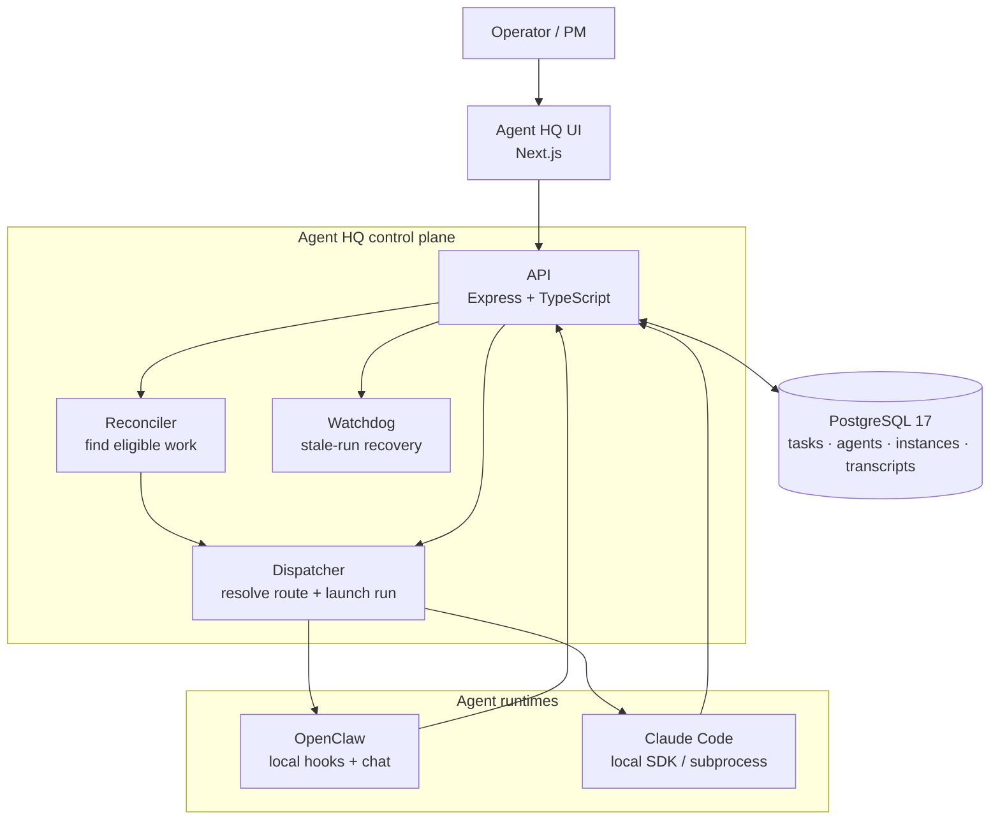
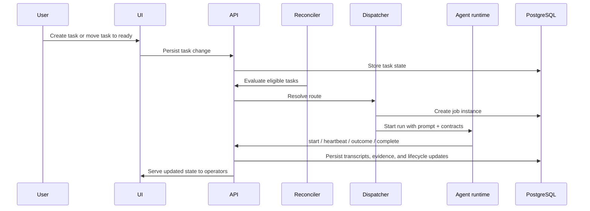

# Agent HQ Architecture Overview

This document is the public-facing system overview for Agent HQ. It complements the deeper implementation notes in [INFRASTRUCTURE.md](../INFRASTRUCTURE.md).

## System map

## Core components

- `UI`: the operator surface for tasks, agents, chat, routing, projects, workflows, logs, and telemetry.
- `API`: the central control plane. It owns task state, lifecycle transitions, transcript persistence, MCP endpoints, and runtime integration.
- `Reconciler`: periodically finds tasks that are eligible to move forward and hands them to the dispatcher.
- `Dispatcher`: resolves the correct agent from routing rules, creates job instances, materializes runtime context, and launches the run.
- `Watchdog`: monitors stale or orphaned runs and applies recovery behavior.
- `PostgreSQL`: the durable system of record for projects, tasks, agents, instances, routing, artifacts, and transcripts. Numbered migrations are the only schema authority.

## Runtime model

Agent HQ supports multiple execution backends behind one workflow model:

- `OpenClaw`: local agents with hooks, chat sessions, shell access, and workspace tools.
- `Claude Code`: local SDK/subprocess-based runs with Agent HQ-provided context and callback contracts.
The dispatcher chooses the correct runtime from the agent record. Task lifecycle and routing semantics stay consistent across runtimes.

## Workflow model

The workflow configuration is the source of truth for task movement:

- `workflow_task_routing_rules` (assignment rules) decide which agent handles a task for a given workflow, task type, and status. A status with no matching rule never dispatches.
- `workflow_task_transitions` decide which outcomes are valid from the current status and what status each outcome moves to.
- `workflow_task_transition_requirements` define evidence gates per outcome and task type, with severity `block` or `warn`. There is no global fallback: an outcome with no rows is ungated.
- Workflow phase labels such as `implementation`, `review`, `release`, and `pm` are derived from status/outcome configuration for internal contract branching only. They are not persisted transition metadata and do not make evidence fields required.

Outcome validation and contract generation both read this configuration. The system should not infer blocking evidence requirements from workflow phase labels, status names, outcome names, or contract examples.

## Primary data flow

## Routing and execution lifecycle

At a high level:

1. A task is created or moved into a status that has an assignment rule, such as `ready` in the starter dev workflow.
2. The reconciler evaluates assignment rules using workflow, task type, and current status.
3. The dispatcher picks the correct agent route, builds a contract from configured outcomes and evidence gates, and launches a job instance.
4. The runtime sends progress and completion signals back to the API.
5. The API records transcripts, evidence, and outcome transitions.
6. The watchdog intervenes if a run becomes stale or orphaned.
