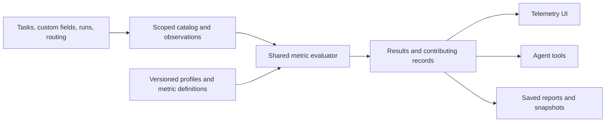

**Configurable telemetry — product and technical specification**

Status: Accepted; implementation and validation are recorded in the [release record](configurable-telemetry-release.md). Prepared September 9, 2026 against Agent HQ checkout `6bfecc2e`.

This specification replaces the repair-first sequencing in the [telemetry audit](telemetry-audit-2026-09-09.md). The primary work is to build configurable reporting. Correctness, scope enforcement, and explainability are properties of that implementation. The existing fixed dashboards and disconnected schema editor are not the foundation to expand.

**1. Product contract**

Users and authorized agents can define, calculate, save, compare, and track statistics over tasks, workflow activity, projects, agents, and runs using the configuration and custom fields those users actually employ.

A metric's name does not determine its meaning. Success, completion, approval, submission, blockage, rework, first pass, throughput, and cycle time are user-defined interpretations. The metric editor may suggest definitions from workflow configuration, but it must show the selected meaning and allow the user to change it.

For example, three metrics may all be named “First-pass rate”:

| Context | Qualifying success | Possible rework definition |
|---|---|---|
| Software delivery | Task enters `done` | Selected QA rejection outcome or return to an implementation stage |
| Content approval | Task enters `approved` | `changes_requested` outcome or revision-request field changing to true |
| Proposal workflow | Task enters `submitted` | Resubmission, a return to drafting, or a configured revision count |

These status names are examples, not reserved values. Even within one workflow, a delivery metric and an editorial metric may use different success and rework definitions. Reaching a configured milestone is not automatically “first pass”: the user also specifies which attempts/rework matter and which population forms the denominator. Users remain free to name a simpler milestone-attainment measure “First pass”; the saved definition and explanation reveal precisely what it counts.

The system supports both private-by-scope analysis within an authorized project and tenant-wide operational reporting. “User configurable” initially means configuration available to the existing operator and MCP identities. Personal ownership/sharing between authenticated human accounts is not assumed; the current product does not supply that identity model.

**2. Three layers**

| Layer | Responsibility | Example |
|---|---|---|
| Observations | Record what happened or what is currently true, without interpreting business success | A status changed; an outcome was accepted; a numeric field changed; a runtime execution ended unsuccessfully |
| Measurement profiles | Name reusable predicates and measurement boundaries for a scope | Delivery success = entry into selected status; rework = selected outcome; blocked = unresolved prerequisite or chosen field predicate |
| Metrics and reports | Select a population and calculate over observations, optionally using a profile | Percentage of evaluated task journeys that reached delivery success without rework, grouped by agent |

A profile is optional. A one-off numeric sum can directly reference a field. Multiple named profiles can coexist in a workflow. Profile concepts are user-defined named conditions, not a compulsory global list of success/failure stages. Starter recipes expose convenient slots such as `start`, `success`, `rework`, and `cancelled`.



Telemetry observes workflow execution. Defining a metric or profile does not change statuses, routing, gates, task values, or agent assignment. Routing changes remain actions in the existing routing system. Automated operational changes triggered by metrics are outside the initial release.

**3. Core observations and configurable interpretations**

The platform owns a deliberately small catalog of stable observations:

- Task creation, field/assignment/scope changes, deletion, and status transitions.
- Accepted workflow outcomes and received/mapped workflow events, including their causal relationship to resulting transitions.
- Run creation/start/end, runtime execution terminal state, cancellation/interruption, recorded handoff state, and available token usage.
- Relationship additions/removals and observable prerequisite resolution changes.
- Configuration identity at execution: actual agent, runtime, model, instruction/config fingerprint, and matched routing rules where recorded.

Core runtime templates have versioned platform definitions: count runtime failures, count cancelled executions, elapsed runtime duration, token usage, and missing required handoffs. A runtime failure is established by runtime execution evidence, not by a task status named `failed`. A successful runtime can fail to provide a required handoff; a workflow can reject its work; an operator can stop it. Those are distinct observations. A run row marked `failed` is exposed as a run-state fact with its reason and provenance, not automatically described as a provider/runtime failure.

Adapters normalize provider evidence to this contract and retain unknown classifications when evidence is insufficient. Platform metric formulas are immutable by version; users can clone/filter them and create custom failure rates. Even core rates state their denominator—for example, known successful or failed terminal runtime executions, excluding cancelled/lost/unknown executions and reporting their counts separately.

Everything that expresses business meaning is configurable: success, blocked work, quality, rework, workflow completion, agent effectiveness, SLA breach, and financial/business quantities. A terminal workflow status means terminality only, not success. Backward movement in a routing graph may be suggested as rework, but is not automatically classified as rework. Display order is not a semantic definition.

**4. Catalog and references**

The field/signal picker is populated from the effective, authorized task schemas, workflow types, task types, workflow status definitions, outcomes, routing transitions, event mappings, agents, and built-in run fields. It presents scope, type, supported operations, unit, coverage, and historical availability for every entry.

Initial custom-field support follows canonical types: text, textarea, URL, select, number, and checkbox. Numbers support arithmetic; select/text support comparisons and bounded grouping; checkboxes support boolean predicates and rates. Canonical date/datetime types and unit/currency metadata are extensions to the existing schema system, not a separate telemetry schema. They must be implemented there before the metric builder offers those types. An arbitrary date-looking text value is not silently parsed.

Tasks expose custom fields. Workflows, projects, and agents initially expose their existing metadata and aggregates of related tasks/runs; the spec does not assume those entities already have custom-field schemas. The catalog provider interface accepts future entity schemas without adding an entity-specific report engine. Adding custom-field editors/storage for additional entity types is an independent product extension.

Every catalog entry has an opaque stable identity and immutable descriptor revisions. Descriptors reference canonical source definitions; they do not create an independently editable field schema. Existing field keys are registered with their source scope and owner. Label changes retain identity and create a descriptor revision. Key changes create a new identity unless an explicit canonical rename/mapping establishes continuity; incompatible type changes create a new identity. Removing and later re-adding the same key does not silently recover the retired identity. Same-named fields in two unrelated schemas are not assumed equivalent. Overrides resolve through the canonical schema rules, with compatibility checked against the resulting field type and unit.

Saved definitions pin the descriptors needed to interpret their data. Renaming/removing a live status or field preserves historical descriptors; it never reinterprets old values under a new meaning. Compatible label changes need no formula change. Broken live references mark affected bindings as needing attention, preserving historical queries that still have the required descriptors. Type conversion or cross-schema mapping requires an explicit new metric revision.

Catalog reads must be tenant/project authorized themselves. Existing schema helpers are not assumed safe merely because they already exist; their query scoping must be verified at the integration boundary.

**5. Scope, reuse, and overrides**

A metric has a stable family key, immutable formula revisions, and one or more scope bindings. A binding selects a formula revision, optional profile revision, parameter values, and applicability. A profile can be reused by several metrics. A scope may narrow by tenant, project, workflow type, workflow instance, and task type. Agent selection is usually a filter/grouping rather than a separate meaning of a workflow metric.

Resolution is explicit and deterministic. For a family key and concrete task context, the first enabled or explicitly disabled binding in the following order wins:

1. Workflow instance + task type, then workflow instance.
2. Project + workflow type + task type, then project + workflow type.
3. Tenant + workflow type + task type, then tenant + workflow type.
4. Project default, then tenant default.

Task-type-only bindings without a workflow type/instance are rejected because identical type names may describe unrelated work. Workflow instance bindings imply and validate their tenant/project/type. A disabled binding suppresses inheritance at that scope. Duplicate bindings at the same specificity are invalid. Whole definitions are replaced on override; hidden property-by-property JSON merges are not used. Arbitrary population predicates filter the selected metric and do not participate in precedence.

The UI displays the winning binding, origin, and overrides before saving. Profiles are resolved and pinned in the binding, eliminating a second independent precedence cascade. Editing creates a revision with an impact preview; it does not rewrite old definitions. A new binding changes which definition is selected for new requests using the effective family. Saved reports pin a resolved definition bundle by default and offer an explicit “Update definitions” action.

Filters only narrow authorized scope. Metric parameters cannot broaden access or choose another tenant. An explicit authorized cross-tenant operator view remains separate from ordinary tenant reporting.

**6. Measurement contract**

Each saved metric specifies:

| Property | Required meaning |
|---|---|
| Population/grain | One row represents a task, run, runtime execution, transition, measurement journey, workflow, project, or agent |
| Inclusion | Configured scopes, task types, field predicates, and exclusions |
| Value | Typed field, event count, derived value, elapsed duration, or component measure |
| Aggregation | Count/distinct count, count-if, sum, mean, min/max, percentile, ratio, distribution, or explicit rollup |
| Time basis | Current snapshot, observation occurrence, cohort entry, or journey resolution time |
| Boundaries | Milestones, attempt/reset policy, timeout, cancellation, open-work policy, and duration pairing when relevant |
| Attribution | Assigned owner now/at entry, executing agent, selected event actor, or outcome-producing agent |
| Presentation | Name, description, unit/precision, bucket/timezone, and preferred visualization |
| Missing data | Unknown/null behavior, exclusions, and coverage requirements |
| Dependencies | Formula/profile/catalog revisions and any component metrics |

Supported initial expression operations are typed comparisons, `all`/`any`/`not`, membership, null/missing checks, arithmetic, conditional values, event existence/counts within a bounded journey, duration, aggregation, and ratios. Bounded derived row expressions allow `quantity * unit_price` before aggregation. Formula dependencies form a DAG; cycles, dimension/type mismatch, unbounded recursion, arbitrary SQL/JavaScript, and unknown operators are rejected.

The engine uses an allowlisted typed expression tree shared by UI and MCP. It compiles against catalog-provided SQL expressions and parameterizes user values, including JSON field paths. The UI provides a guided builder and an advanced structured-expression editor with the same validation and preview. Unsupported formulas receive specific errors rather than approximations. Higher-order statistics can later extend this operator registry.

Rollups are explicit. “Average amount per task” differs from “average of each project's total amount.” A task-to-many-runs or task-to-many-agents relationship cannot multiply task counts or monetary amounts accidentally. Reduce child records to the selected grain before joining, use distinct membership, or require an explicit allocation method. First release attribution gives each sample one agent; multi-agent participation is a separate membership view with non-additive totals, not a silent full-credit duplication.

Ratios return numerator and denominator as well as the percentage. Empty denominators produce null/“No qualifying records.” Missing fields, invalid historical values, unavailable evidence, and numeric zero are distinct. Users can explicitly define missing-as-zero for an appropriate numeric measure; the default excludes unknown numeric values and reports coverage. Predicates use three-valued logic, so missing evidence does not prove “no rework.”

For a recipe's rate, establish the shared eligible population before evaluating its numerator and denominator. Under `exclude_and_report`, a sample missing evidence required to classify that rate is excluded from both components and counted as unknown. A known success with unknown rework history cannot silently enter only the denominator. Explicit alternative missing-data policies must describe how they change the calculation.

Percentiles use continuous interpolation over qualifying samples. Rate rollups sum compatible numerators/denominators: 8/10 plus 1/2 is 9/12 = 75%, not the mean of 80% and 50%. Currency and incompatible units cannot be summed without an explicit conversion measure and conversion-date policy.

Time ranges are half-open `[from, to)` using typed UTC timestamps. Calendar buckets use the report's IANA timezone and its daylight-saving rules. Open durations stop at the query's fixed `as_of`, never a separate wall clock for each row. Created-at cohorts and success-arrival buckets are different selectable views; the engine does not use task `updated_at` as a substitute for milestone time.

**7. First-pass journeys and reusable workflow calculations**

A measurement journey is a metric-defined interval for an entity. It is independent of an agent run or a workflow routing stage. For the first-pass recipe, the user chooses:

- Start signal, such as task creation or entry into review.
- Success signal, such as entry into `done`, `approved`, or `submitted`, a chosen accepted outcome, or a custom-field condition becoming true.
- Rework/disqualifying signals and, optionally, what starts another attempt.
- Final unsuccessful resolution, cancellation/exclusion, and optional elapsed-time limit.
- Denominator: evaluated journeys, successful journeys, or all eligible started journeys.
- Counting policy: one journey per task, one per explicit reset, or one per stage visit. Additional starts during an open journey are ignored by default; a recipe may count them as attempts. Overlapping journeys are outside the first release.

The recommended recipe starts once per task, resolves on its first success or configured final unsuccessful signal, marks rework without closing the journey, excludes cancellation, and excludes still-open work from an evaluated denominator. Every choice is visible and configurable. A later reopen does not mutate a resolved sample; an explicitly configured reset starts another journey. A “latest state” metric is available when the user wants the current result instead.

At fixed `as_of`, evaluate events in effective-time order, with source sequence/causal order breaking ties. If contradictory independent signals have no established order, classify the sample as unknown. Duplicate delivery of the same observation changes nothing. One outcome and its resulting transition share a causal ID; a signal selecting either cannot count both as two attempts.

Default first-pass calculation:

```text
numerator   = evaluated journeys resolved successfully
              with no selected rework/disqualifier before or at resolution
              and satisfying the configured attempt limit, if any
denominator = successfully or unsuccessfully resolved, eligible journeys
result      = numerator / denominator
```

Open, cancelled, timed-out, and unknown counts accompany the result. Timeout counts as unsuccessful only when a timeout rule explicitly says so. All-started denominators include open work as non-numerator samples and display that choice. Runtime failure only disqualifies a business journey if the user selects it. An absence-based claim such as “no rework occurred” is unknown unless coverage spans the full relevant interval.

The same engine supports milestone conversion, multi-step funnels, number of revisions, selected-stage dwell time, time to approval, blocked-at-snapshot rate, ever-blocked-during-journey rate, and percent of observed journey time blocked. These are separate recipes over shared primitives. Durations specify first/last/each matching start/end, pairing, resets, pause conditions, and treatment of open intervals; no inferred business-hours calendar is assumed.

The initial funnel recipe counts distinct eligible journeys reaching user-selected steps in order, taking the first qualifying occurrence of each successive step within the journey. It exposes conversion from the entry cohort and from the preceding step. Repeated visits do not multiply the population. Unordered milestone counts are a separate configurable measure.

For field-conditioned milestones, initial truth is not a historical transition. The user selects “matches at journey start” or “becomes true after start.” Interval/delta measures require field-change history and do not synthesize past transitions from today's value.

**8. Cross-workflow comparison**

Different success statuses can represent the same business milestone. Users can declare compatible bindings in a comparison family, mapping `done`, `approved`, and `submitted` to their intended common concept. This is an explicit semantic choice, not an inference from matching metric names or status labels.

Before combining results, validate units, grain, denominator, time/cohort basis, attribution, journey/reset policies, and the declared equivalence of selected milestones/rework. The dashboard shows separate series by effective definition by default. A rollup requires a declared comparison contract and compatible definitions; changing a material definition requires reviewing that contract. Reports cannot silently blend “per review attempt” with “per task,” or “current blocked inventory” with “ever blocked.”

Current-state reports group a task by its current project/workflow unless another supported basis is selected. Journey cohorts use project/workflow/task type at entry by default; event reports use occurrence-time dimensions. Moving a task later does not change an entry cohort's membership. Retrospective grouping by current ownership is an explicit alternative. The query engine partitions a family-key query by effective binding and only combines the resulting measures under the comparison rules above.

**9. Definition and query contracts**

The following is an illustrative version-1 definition shape; IDs are symbolic references, not current database records. The implementation will make the versioned Zod schema the authority and generate REST/MCP contracts from it.

```json
{
  "format_version": 1,
  "family_key": "first_pass_rate",
  "name": "First-pass approval rate",
  "dataset": "journeys",
  "subject": "task",
  "profile_revision_id": "content-review-profile-v1",
  "population": { "task_types": ["article"] },
  "journey": {
    "start": { "signal_ref": "profile.start" },
    "success": { "signal_ref": "profile.success" },
    "unsuccessful": { "signal_ref": "profile.final_failure" },
    "rework": { "signal_ref": "profile.rework" },
    "cancel": { "signal_ref": "profile.cancelled" },
    "counting": "first_per_task",
    "additional_starts": "ignore",
    "cancellation_policy": "exclude",
    "open_policy": "exclude",
    "timeout": null
  },
  "measure": {
    "kind": "ratio",
    "numerator": {
      "aggregate": "count_if",
      "where": {
        "all": [
          { "field": "journey.resolution", "op": "eq", "value": "success" },
          { "field": "journey.disqualified", "op": "eq", "value": false }
        ]
      }
    },
    "denominator": {
      "aggregate": "count_if",
      "where": { "field": "journey.resolution", "op": "in", "value": ["success", "unsuccessful"] }
    }
  },
  "time_basis": "journey_started_at",
  "attribution": "assigned_agent_at_entry",
  "missing_policy": "exclude_and_report",
  "unit": "percent"
}
```

An optional attempt-limit predicate can be added to the numerator. The compiled profile binds the symbolic success signal to the scoped `approved` status, rework to the selected rejection/revision signals, and the other references to explicit conditions. Missing required signal bindings prevent activation; optional absent signals are represented explicitly, not guessed.

The example shows a concrete compiled profile revision. Reusable templates can leave this as a required binding parameter; resolution produces exactly one pinned profile revision in the definition bundle. A binding conflicting with a formula's already-pinned profile is rejected rather than silently overriding it.

A current numeric metric needs only a scoped task population, a catalog field reference with `value_basis=current`, and an aggregation such as `sum`. Query requests supply a saved revision/bundle or a draft definition, additional narrowing filters, requested groupings, time window, timezone, and visualization-independent output options. All filter effects apply to numerator, denominator, subtables, and drilldown through one population definition unless a component explicitly declares a different, compatible population.

Every result contains:

- Resolved definition/profile/catalog versions, query hash, authorized effective scope, and a plain-language calculation description.
- Values, group keys/labels, units, numerator/denominator where applicable, and sample count.
- Eligible, included, excluded, missing, invalid, pending, cancelled, and unknown counts where applicable, plus reasons. These categories are defined per recipe; arbitrary counts are not presented as an additive total if they overlap.
- Effective `as_of`, evaluation time, data revision, historical coverage boundary, projection lag, and whether the result is complete, partial, stale, or unavailable.
- A scoped result token for paginated contributing records and inclusion/exclusion explanations. The token binds the same definition, filters, time boundary, and data revision. It is not authorization: drilldown rechecks access.

Ratios are returned as numeric fractions with `unit=percent`; presentation applies the percentage format. Numeric precision/rounding happens at display boundaries, not before aggregation. The evaluator retains exact decimal arithmetic for decimal-valued measures. API values that exceed safe JSON numeric precision use an explicit decimal encoding instead of silent truncation.

Errors are structured: `invalid_definition`, `incompatible_field_type`, `unknown_reference`, `ambiguous_binding`, `incompatible_comparison`, `insufficient_history`, `unsupported_operation`, `query_limit_exceeded`, and normal authorization errors. A partial calculation must never appear as an ordinary zero.

**10. Capture, storage, and history**

Use PostgreSQL and the existing async database adapter. Build an analytics read model alongside the application; do not rewrite task execution as a new event-sourced application.

| New conceptual table | Purpose and important constraints |
|---|---|
| `telemetry_catalog_entries`, `telemetry_catalog_revisions` | Scoped logical identities and immutable descriptors; unique source identity per tenant/scope |
| `telemetry_profiles`, `telemetry_profile_revisions` | Named reusable signals and interval policies; immutable revisions and audited edits |
| `telemetry_metrics`, `telemetry_metric_revisions` | Stable family/definition identities, typed expression JSONB, dependency manifest, revision/hash |
| `telemetry_metric_bindings` | Scope, enabled/disabled state, formula/profile revisions, parameters; one binding per family and exact scope |
| `telemetry_outbox` | Minimal durable observations written with canonical mutations; unique source/idempotency identity, pending/processed/error state |
| `telemetry_observations` | Append-only normalized facts with effective/recorded timestamps, entity identity, source provenance, causation, sequence, and snapshot references |
| `telemetry_entity_snapshots` | Deduplicated typed custom values and dimensional/config context needed at observation time; no independent user-editable schema |
| `telemetry_journey_samples` | Optional rebuildable projection keyed by definition bundle, entity, and episode; coverage and resolution metadata |
| `telemetry_reports`, `telemetry_report_revisions` | Named report/dashboard layouts, metric revision bundles, filters, comparison contracts, and display preferences |
| `telemetry_query_results`, `telemetry_report_snapshots` | Expiring query metadata/results for consistent drilldown and optional persisted report snapshots |
| `telemetry_projection_state`, `telemetry_backfill_jobs` | Capture/coverage versions, per-source progress, replay/checkpoint state, and failure visibility |

These are proposed tables, not claims about current storage. Add tables incrementally with the milestone that uses them. Every owned row has `tenant_id NOT NULL`. Relationships between owned rows enforce tenant agreement using composite keys or equivalent constraints. Use typed `timestamptz`, JSONB, numeric values, and indexes beginning with tenant and common project/entity/time filters. Metric/report/config mutations use optimistic concurrency and an actor audit; do not invent an authenticated human identity when only the local operator identity is available.

An observation envelope includes `observation_id`, `schema_version`, `tenant_id`, source and source-event key, entity kind/id, optional durable run/execution identity, effective `occurred_at`, `recorded_at`, per-entity sequence, `causation_id`, event type, context snapshot IDs, and provenance/coverage flags. Payloads use an event-specific typed schema. A task scope move contains both old and new scope; ordinary observations record scope at occurrence. Field-change events preserve typed before/after values or a referenced snapshot/delta sufficient to reconstruct them.

Canonical state mutation and the minimal outbox insert commit together using the caller's transaction handle. Heavy normalization, interval calculation, aggregation, and delivery do not run in that transaction. Worker failure leaves retryable observations and reports lag. If the minimal durable insert fails, the corresponding DB mutation does not report a successful committed change. External runtime execution itself cannot be rolled back: failed callback persistence is retried/reconciled using stable source identity, without claiming the runtime did not terminate.

Capture integrates with task create/edit/delete, status changes, outcomes, dependencies, assignments, dispatch, runtime terminals/cancellations, and routing/schema mutations. Imports/clones either use the same paths or write explicit import observations. Reconciliation uses the same observation contract. Do not rely solely on existing best-effort `emitTaskEvent` calls or notes; some writers omit dimensions and their failures are currently swallowed.

Provider token usage may arrive as cumulative snapshots. Normalize/update a per-run usage fact with source version before summing; do not sum every callback as additional tokens. Corrections and late observations are append-only revisions with a `supersedes` relationship; logical-fact selection prevents duplicate totals. A contradictory correction is visible and never resolved by silently choosing whichever request arrived last.

Capture a bounded, authorized analytics subset of data: declared task fields and relevant dimensions. Do not copy secrets, opaque runtime handles, credentials, prompts, or transcripts into the metric store. Runtime configuration is represented by safe descriptors and fingerprints. New configuration snapshots refer to canonical configuration versions/hashes; the routing graph/trace remains the shared source for explaining rule resolution.

**11. Historical semantics and reproducibility**

Current inventory queries can read canonical tables directly in one consistent transaction snapshot. A report evaluation uses a shared evaluation context across cards and components, including a consistent source snapshot when querying current state. Historical metrics use observations and temporal snapshots. A field selector explicitly declares `current`, `at_entry`, `at_event`, or `at_resolution` where supported. The evaluator rejects unavailable bases rather than substituting today's value.

Starting capture establishes a coverage boundary for each source/scope. Bootstrap snapshots establish state at that boundary; they do not prove earlier status entries or field changes. Backfill can import trustworthy task history, events, run timestamps/usage, and routing audit snapshots with source deduplication. Ambiguous actor/time/config values stay unknown. Existing telemetry summaries can be exposed as legacy recorded measures but cannot establish complete event history or an authoritative first-pass result.

Metric version and observation-time workflow configuration are independent. A user can apply a newly drafted definition to older observed facts, explicitly previewing a retrospective calculation. That does not assert that the new definition or today's routing was active when those facts occurred. Route-history explanations use recorded matches/config snapshots; missing old snapshots are disclosed rather than replayed against today's graph as historical truth.

Every evaluation pins a data revision and resolved definition bundle. Live reports may change as late evidence/backfill arrives, with coverage/recalculation indications. Frozen report snapshots retain their computed values and definition bundle unless explicitly replaced or affected by a required data purge. Reproducible drilldown is guaranteed only within the declared result/history retention window; after expiry the system returns an expired result, not a newly calculated answer under the old token.

Retain contribution proofs or versioned observation/snapshot references sufficient to reproduce that result's membership and values during its retention window. In particular, a current-table result cannot use a later query against mutated task rows as its original drilldown. If retaining the required evidence exceeds an interactive budget, use the bounded asynchronous path or return a specific limit error.

Outbox processing tracks committed work and pending gaps, not merely `MAX(id)`, which can skip transactions that commit out of sequence. Query cache keys include authorization scope, definition bundle, parameters, time boundaries/timezone, attribution, and data/projection revision. A permission change invalidates affected cached access; saved results never grant access to removed projects.

Historical grouping does not override current access control. By default, a historical sample must satisfy the chosen historical scope and the caller's current authorization to its source entity where that entity still exists. Moving a task into an inaccessible project can therefore restrict access to its historical samples without rewriting their recorded cohort. A retained result whose contributor access is no longer valid is unavailable until an authorized recalculation; returning its old aggregate is not an access-control shortcut.

Closed/archived workflows remain in historical populations by default. Hard deletion and tenant purge follow the application's explicit deletion policy, including stored field snapshots, caches, and retained results; telemetry is not a hidden recovery copy. If source removal makes an old result unexplainable, mark it unavailable/redacted. Retention length and snapshot storage limits are tenant settings subject to operator control, not fixed product promises.

**12. User and agent experience**

The Telemetry page becomes a report workspace with saved reports, a metric library, and an explorer. A report can contain KPI cards, grouped tables, time series, distributions, and configured workflow funnels. Each card has “Definition” and “Contributing records,” showing the business meaning and the records behind it. Global filters show their applicability to every card; an incompatible card filter must be explained or rejected, never silently ignored.

Create-metric flow: choose subject/scope; choose a recipe or blank measure; choose canonical fields/milestones; set calculation, population, time, and attribution; preview actual values and inclusion examples; save a named definition and optional reusable scope binding. Advanced controls progressively reveal denominator, reset, history, and comparison settings. Human-facing explanations use actual selected workflow labels rather than internal DSL terminology.

The workflow graph offers “Measure this stage/transition” and preselects the corresponding scoped catalog signals. Creating that measure never edits the selected route. Workflow definitions may offer a Metrics area for templates/profiles, and a workflow instance can show inherited definitions and overrides. No second field editor is added: “Manage fields” links to canonical workflow field configuration.

Examples of generated descriptions:

> Among articles that entered Review this month and have an evaluated result, count those reaching Approved without a Changes requested outcome. Exclude cancelled articles; show unfinished articles separately. Group by the agent assigned when review began.

> Sum Proposal amount recorded when a task first entered Submitted, grouped by project and submission week.

The builder supports free naming; recipe names and descriptions are suggestions. A new tenant initially sees core runtime observations and suggested recipe drafts. Business metrics are not activated by guessing that `done` or any terminal status means success. Profiles supplied by a starter workflow package are ordinary inspectable configuration.

Proposed agent tools: `agent_hq_list_telemetry_catalog`, `agent_hq_list_metrics`, `agent_hq_preview_metric`, `agent_hq_save_metric`, `agent_hq_query_metrics`, `agent_hq_get_metric_contributors`, `agent_hq_list_telemetry_reports`, and `agent_hq_save_telemetry_report`. They reuse REST validation/evaluation and return definition, scope, sample size, coverage, and explanation—not just a number. Writing metrics never grants permission to edit workflow definitions or task fields.

Introduce explicit capabilities such as `telemetry.read`, `telemetry.query`, `telemetry.manage_metrics`, `telemetry.manage_reports`, and `telemetry.export`, integrated with existing MCP policies and project scope. Authorization includes referenced fields/resources and every branch of a derived query, even if only aggregate output is requested. Full admin access is not required for ordinary scoped analytics. Personal reports/sharing can be added when authenticated human ownership exists; first release supports tenant/project/workflow report visibility.

**13. Proposed API**

Use a distinct `/api/v1/telemetry/v2` router during migration so legacy responses cannot be mistaken for the new contract. Workflow terminology is canonical in its payloads; no physical sprint-table rename is required.

| Endpoint | Purpose |
|---|---|
| `GET /catalog` | Authorized fields, signals, recipes, scopes, operations, units, and coverage |
| `POST /definitions/validate` | Type/scope/dependency validation and plain-language interpretation |
| `POST /queries/preview` | Evaluate a bounded draft without saving configuration |
| `GET/POST /metrics`, `GET /metrics/:id` | Discover/create metric families and inspect revisions |
| `POST /metrics/:id/revisions` | Save a revision with optimistic concurrency and impact preview |
| `GET/POST /profiles`, `POST /profiles/:id/revisions` | Reusable conditions and journey boundaries |
| `GET/PUT /bindings` | Resolve/modify exact scoped bindings with validation and audit |
| `POST /queries` | Run explicit revision bundles or resolve effective family bindings |
| `GET /queries/:id`, `GET /queries/:id/contributors` | Result/status and same-population paginated explanations |
| `GET/POST /reports`, `POST /reports/:id/revisions` | Saved dashboard/report definitions |
| `POST /reports/:id/snapshots` | Freeze a result with pinned definitions and provenance |
| `GET /coverage`, `GET/POST /backfills` | Coverage visibility and authorized replay jobs |

Archive operations for metrics/profiles/reports preserve referenced revisions. Administrative maintenance endpoints are separately authorized. Queries may return 202 with a job ID when historical work exceeds the interactive budget; preview is bounded and clearly labeled if it samples. Preview sampling is not saved as the full metric result.

Implementation starting limits: 10 component measures, 3 grouping dimensions, expression depth 12, 500 expression nodes, 1,000 returned groups, and paginated contributors capped at 200 per page. Use a five-second interactive statement budget and move eligible larger work to bounded background jobs. Refuse unsupported/unbounded work with actionable errors. These are configurable operator limits and tuning hypotheses, not measured throughput guarantees.

No additional warehouse or streaming service is required initially. Projections/cache/background jobs should be introduced where measured query costs justify them. Performance targets must be checked on a published representative fixture and recorded hardware before release.

**14. Delivery scope and compatibility**

The first complete configurable release includes canonical field discovery; current and observation-based aggregates; configurable journeys/first-pass/durations and basic funnels; scope bindings and immutable revisions; report builder, saved reports, drilldown; core runtime observations; scoped agent access; coverage/backfill; and project/workflow import/export reference remapping for telemetry definitions. The implementation plan delivers this through smaller usable milestones.

Subsequent extensions include scheduled evaluations/snapshots, threshold notifications, richer formula operators, business-hours calendars, advanced cohort/survival statistics, personal sharing, external BI connections, and new custom-field entity providers. Their absence must be clear in the catalog. Alerts will specify the metric revision, evaluation interval, maturity/coverage requirement, threshold, and notification policy; they will not bypass the shared evaluator.

The old Schema Config editor is retired when the new catalog-driven workspace becomes the default. Its settings are not copied into canonical task schemas automatically. Existing legacy summaries are preserved/labeled until their consumers are migrated; no synthetic data is invented to make the old KPIs agree with new definitions. The separate `spawned_defects` consumer must be accounted for before any legacy table removal.

The audit's calculation/UI issues are handled through replacement and new contracts. There is no preceding campaign to perfect fixed first-pass/block metrics. Minimum tenant containment for any still-reachable legacy routes belongs in rollout integration; legacy access must not undermine the new scoped access model. Disabling an unused legacy route is acceptable when its consumer inventory supports that choice.

**15. Acceptance criteria**

| Case | Expected behavior |
|---|---|
| Different success milestones | Three workflows bind success to `done`, `approved`, and `submitted`; the same recipe follows each binding, with no status constants in the evaluator |
| Six-task first-pass fixture | A: direct success; B: rework then success; C: runtime failure then success; D: configured final failure; E: open; F: cancelled. Evaluated denominator gives 2/4 = 50%, one pending, one cancelled. B disqualifies; C does not unless runtime failure is selected. |
| Runtime failure selected as rework | Same fixture becomes 1/4 = 25%; runtime evidence is unchanged |
| Successful-only denominator | Same original fixture becomes 2/3; UI displays approximately 66.7% and the changed denominator meaning |
| First milestone per task | Success, reopen, success counts once unless the definition explicitly starts a new journey |
| Custom-field aggregate | Sum and distribution match contributing task values; updating a current field changes current reporting but preserves recorded at-submission values |
| Field becomes true | A bootstrap value of true does not prove a previous false-to-true milestone; interval coverage is exposed |
| Configured blockage | Unresolved dependencies, selected statuses, or custom-field predicates can independently define blocked work; resolved dependencies are not automatically blocked |
| Scope precedence | All eight binding levels resolve predictably; explicit disable stops inheritance; duplicate specificity is rejected |
| Compatible rate rollup | 8/10 and 1/2 combine to 9/12; incompatible definitions remain separate |
| Historical movement | Closing a workflow preserves its history; moving a task does not rewrite its entry-cohort ownership |
| Unknown history | Incomplete rework history produces unknown/excluded coverage, not a first-pass success |
| Runtime semantics | Runtime failure, workflow rejection, cancellation, and missing handoff remain distinct facts and independently selectable predicates |
| Delivery/replay | Duplicate callbacks, retries, out-of-order commit, corrections, and backfill do not double-count; catch-up converges with a fresh rebuild |
| Access parity | Another tenant/project cannot be read through catalog, aggregate, expression dependency, preview, cache, snapshot, export, or drilldown |
| UI/MCP parity | Same definition/filter/as-of/data revision returns identical values and contributor membership through both interfaces |
| Version changes | Saved report stays on its pinned bundle; updating it shows definition differences and result impact |
| Time boundaries | Same-instant timestamp formats, midnight boundaries, timezone changes, and daylight-saving transitions behave consistently |
| Failure behavior | Database/query/collector failure is shown as failed, stale, or incomplete—not an ordinary zero or false “Saved” |

The [implementation plan](configurable-telemetry-implementation-plan.md) defines the build order, code boundaries, and milestone completion checks.
